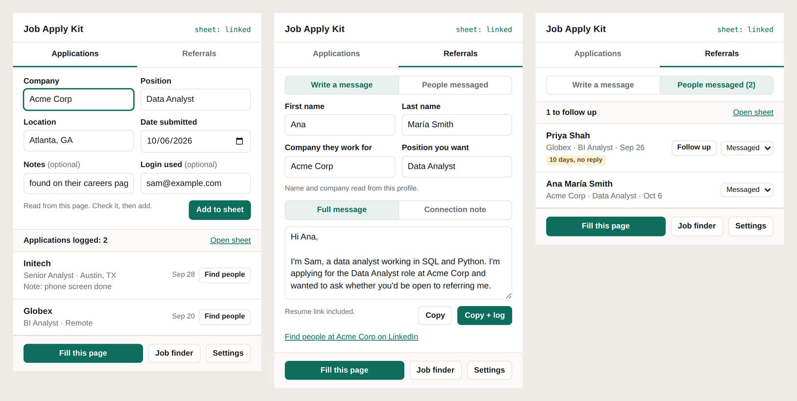

# Job Apply Kit

A Chrome extension for running a job search out of a Google spreadsheet. It
logs the jobs you apply to, drafts referral requests and logs who you sent
them to, and pre-fills application forms. You always press Submit and Send
yourself.



## What it does

| Tab in the popup | What it keeps | Where it's saved |
|---|---|---|
| **Applications** | position, company, location, link, login used, date applied, status, notes | your tracker tab |
| **Referrals** | first name, last name, the company they work for, the date you messaged them | a tab named **Referral Apps** in the same spreadsheet |

- **Log an application in one click.** On a job posting, the company,
  position and location are read from the page.
- **Fill this page** pre-fills application forms from your details and from
  answers you save for questions you keep getting.
- **Write a referral request.** On someone's LinkedIn profile, their name and
  current company are filled in and the message is written around the role
  you applied for. **Copy + log** copies it and records who you messaged.
- **Follow-ups.** Anyone who hasn't replied after 7 days is flagged, with a
  ready-made nudge to copy.
- **Duplicate warnings** when a job is already logged or a person was
  already messaged.
- **Find people** opens a LinkedIn search for a company and role.

## Install

1. Download this repository (Code → Download ZIP) and unzip it.
2. In Chrome, Edge or Brave open `chrome://extensions`, turn on *Developer
   mode*, click *Load unpacked* and pick the **`extension`** folder inside.
3. Pin the extension to the toolbar.

## Link your spreadsheet (about five minutes, once)

Click the extension → **Settings** and follow the steps at the top:

1. Paste your spreadsheet's link, then click **Copy the script**.
2. Open a new Apps Script project at [script.new](https://script.new), paste,
   and save.
3. **Deploy → New deployment → Web app**, with *Execute as: Me* and *Who has
   access: Anyone*. Authorize it when asked.
4. Paste the web app link back into Settings and press **Save and test**. The
   result shows which tab and which columns each field will be written to.

Then fill in the rest of Settings: your details, your resume link, and the
wording of your referral message.

## How your spreadsheet is used

- **Your tracker is found by its headings**, not by its position or name. Any
  layout with headings such as Position, Company, Location or Address, Link,
  Date Applied, Status and Notes works, in any order.
- **Nothing in your tracker is rearranged.** Columns are never added, moved
  or renamed. A field with no matching column is not written, and you're told
  when that happens to a note.
- **Status** gets the value set in Settings ("Applied" by default). If that
  column is a dropdown, the option that matches is used.
- **Referral Apps** is looked for by name. If there's no such tab, one is
  added with these columns: First Name, Last Name, Company, Position, Date
  Messaged, Status, LinkedIn, Notes. A tab you made yourself is used as it
  is, with your headings.
- **Settings at the top of the script** (`extension/Code.gs`):
  `APPLICATIONS_TAB` names the tracker tab outright, `REFERRALS_TAB` changes
  the referral tab's name, and `REFERRALS_SPREADSHEET` takes the link of a
  different spreadsheet to keep referrals in. After editing the script,
  deploy a new version of it.

## Privacy

- Your details, your message wording and your web app link are stored in your
  browser only. Nothing personal lives in this repository's files.
- The script runs inside your own Google account. No other server is
  involved.
- **The web app link works like a password**: anyone who has it can read and
  add rows in those two tabs. If it ever leaks, archive the deployment and
  make a new one.

## What it deliberately doesn't do

- **No auto-submit.** Automated submission breaks most job boards' terms. The
  kit ends at a filled form.
- **No auto-messaging.** Tools that send messages or connection requests for
  you break LinkedIn's terms and put accounts at risk. The kit ends at copied
  text.
- **No bulk collecting.** On LinkedIn it reads the name and current company
  from the one profile you have open, when you open the popup, and nothing
  else. LinkedIn's terms are broadly worded against extensions that copy
  profile details, so there's a switch for this in Settings; with it off, the
  name comes from the tab title and you type the company.

## Job finder (optional)

The **Job finder** button opens a checklist of new postings. It needs a small
local script:

```
pip install openpyxl
python server/app.py
```

It pulls postings from the official Greenhouse, Lever and Ashby APIs for the
companies listed in `server/config.json` into `applications.xlsx`, its own
working list, which is created on first run. Review → queue → **Applied**,
which also logs the job to your Google Sheet.

## If something's off

| You see | What to do |
|---|---|
| `sheet: not linked` | Follow "Link your spreadsheet" above. |
| "Google asked for a sign-in", or status 401 | In Apps Script: *Deploy → Manage deployments → pencil*, set *Who has access* to **Anyone**, deploy. |
| "Couldn't find your application tracker" | The message lists your tabs. Put the tracker tab's name in `APPLICATIONS_TAB` at the top of the script, then deploy a new version. |
| A field isn't being written | Settings → **Save and test** lists the columns it found. Add or rename a heading. |
| "The note wasn't saved" | Your tracker has no column headed Notes. Add one. |
| The wrong company or name on a profile | Fix it in the box before copying. LinkedIn changes its page layout from time to time. |

## What's in the repository

| Path | What it is |
|---|---|
| `extension/` | The extension: popup, Settings page, background worker, form filler. |
| `extension/Code.gs` | The Google Apps Script that reads and writes your spreadsheet. |
| `server/` | The optional job finder (Python). |
| `docs/` | The screenshot above. |
